# SproutSpace: AI Powered Plant Health Diagnostics

SproutSpace is an intuitive mobile application that helps home gardeners diagnose plant health issues using AI powered multispectral imaging. Whether you’re nurturing houseplants or managing a backyard garden, SproutSpace provides personalized, science backed recommendations to help your plants thrive. 

---

## Table of Contents
- [Overview](#overview)
- [Key Features](#key-features)
- [Sample Pages (Mockups)](#sample-pages-mockups)
- [Use Cases](#use-cases)
- [Future Directions](#future-directions)
- [Team](#team)
  
---

## Team Contract

[View Team Contract](./team-contract.md)

## Overview

Many home gardeners struggle to identify what's wrong with their plants, whether it's a nutrient deficiency, pest, or disease. SproutSpace bridges that gap using computer vision and machine learning.

Users simply take a photo of their plant or connect an optional external sensor, and our AI analyzes the data to provide:

- Instant diagnosis
-  Actionable solutions
-  Preventive care strategies

---

##  Key Features

- **Multispectral Imaging**: Upload smartphone photos or connect external sensors via Bluetooth
- **Smart Diagnoses**: Identify nutrient deficiencies, fungal issues, pest damage, and more
- **Tailored Recommendations**: Solutions based on plant type, location, and conditions
- **Gamification**: Earn badges, level up, and compete on gardening leaderboards
- **Community**: Join challenges, share tips, and grow together

---

##  Sample Pages (Mockups)

### Top of Home Page
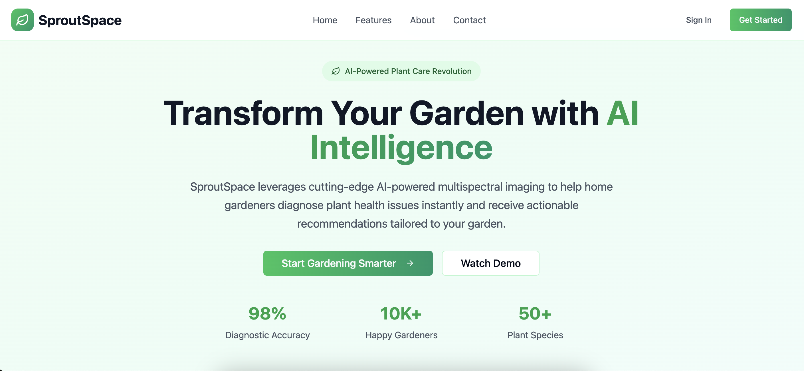  
*Top section of the landing page with app branding and navigation.*

### Second Homepage view (middle)
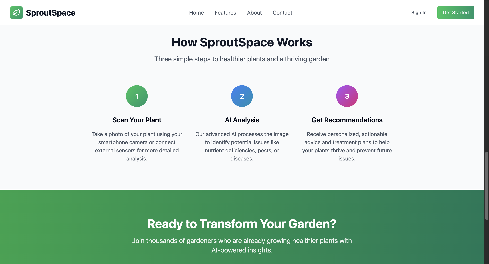  
*Middle of the homepage wiht a simple overview of how users interact with SproutSpace.*

### Log In
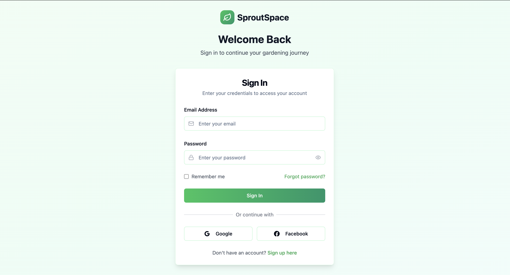  
*Login page for returning users.*

### Create Account
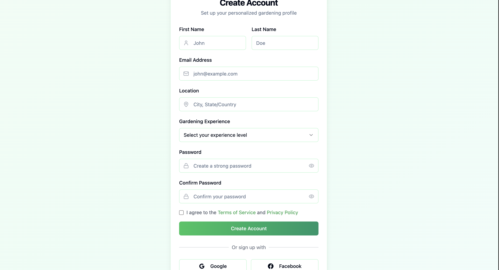  
New user registration page to set up a gardening profile.*

### Bottom of Home Page
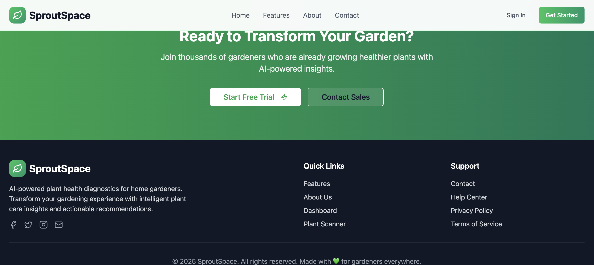  
*App footer section with links and calls to action.*

## Plant Diagnostics
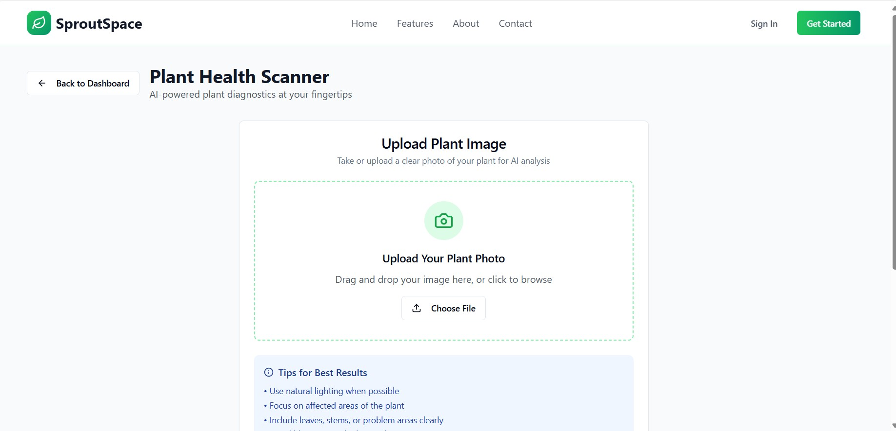

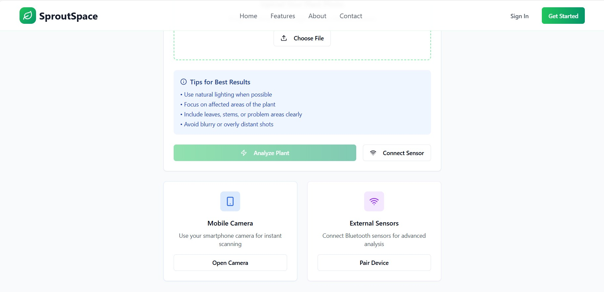
*Page for uploading pictures of plants for further diagnostics*

## Edit Profile
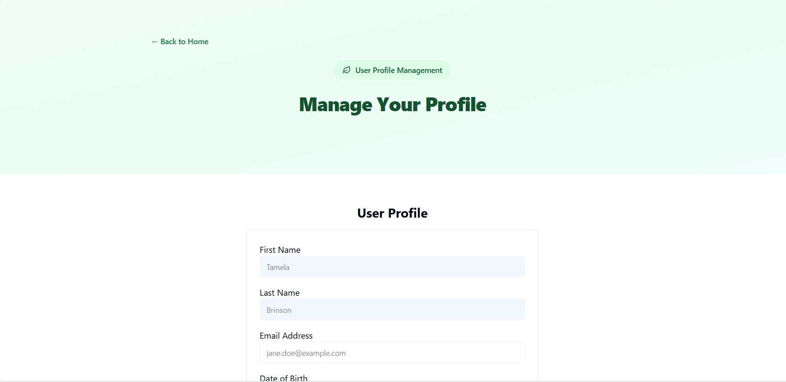

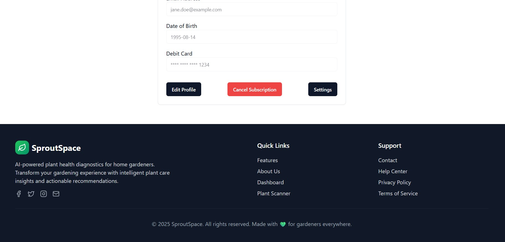
*Page for editing user informaiton and finding settings*

## Setting
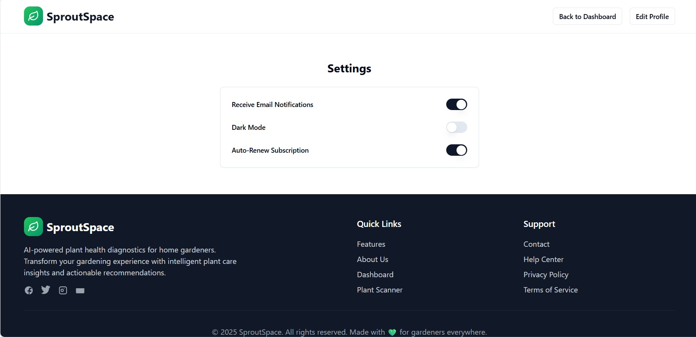
*Settings page to change color modes, email sub and notifications*

## User Dashboard
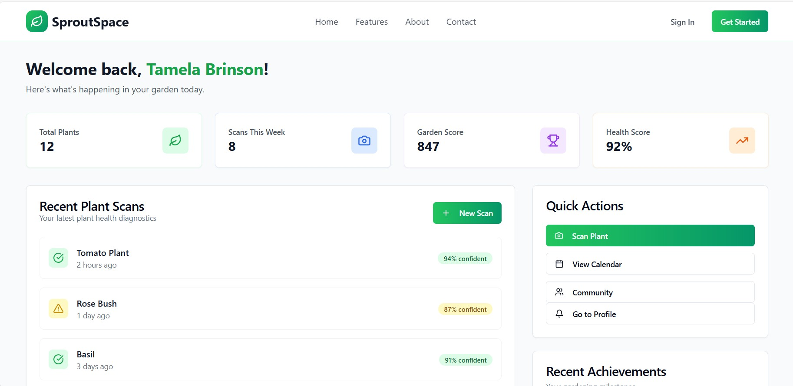

*Where the user will find all the neccessities to enjoy the site*

---

##  Use Cases

- **New Gardener**: Snap a photo, get a quick diagnosis, and follow clear advice
- **Experienced Grower**: Use external sensors and access advanced analytics
- **Community Member**: Earn rewards, share insights, and support others
- **Admin Role**: Maintain AI accuracy, update models, and moderate forums

---

##  Future Directions

- **AR Integration**: Real time treatment overlays using augmented reality
- **Chatbot Assistant**: 24/7 gardening support with AI powered chat
- **Marketplace**: Buy, sell, or trade plants, seeds, and supplies
- **Wearable Syncing**: Integrate with smart gardening tools and receive alerts

---

##  Team

- Kara Kanetis
- Shelby Dixon  
- Tamela Brinson

Project developed at the University of Hawaiʻi at Mānoa as part of ICS coursework.
Visit the repository on GitHub: [github.com/sproutspace/sproutspace.github.io](https://github.com/sproutspace/sproutspace.github.io)
